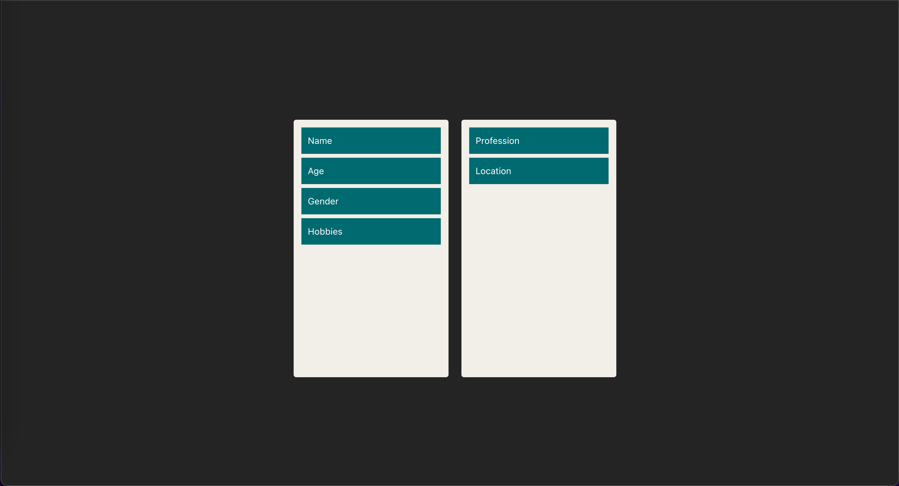

# Simple Drag and Drop

This is a simple application demonstrating how to implement drag-and-drop functionality using `react-dnd`.

## Getting Started

Follow the steps below to set up and run the project locally:

### Prerequisites

- Node.js (v20 recommended)
- npm (comes with Node.js)

### Installation

1. Clone the repository:

   ```sh
   git clone https://github.com/cuongle-ventures/drag-n-drop.git
   ```

2. Navigate to the project directory:

   ```sh
   cd drag-n-drop
   ```

3. Install dependencies:

   ```sh
   npm install
   ```

4. (Optional) Use Node.js version 20 for best compatibility:

   ```sh
   nvm use 20
   ```

### Run the Development Server

Start the development server:

```sh
npm run dev
```

The application will be available at `http://localhost:5173` by default.

## Demo

Below is a preview of the application:



## Features

- Drag-and-drop functionality using `react-dnd`
- Chessboard and Trello-like board examples
- Fully responsive design

## License

This project is licensed under the MIT License.
